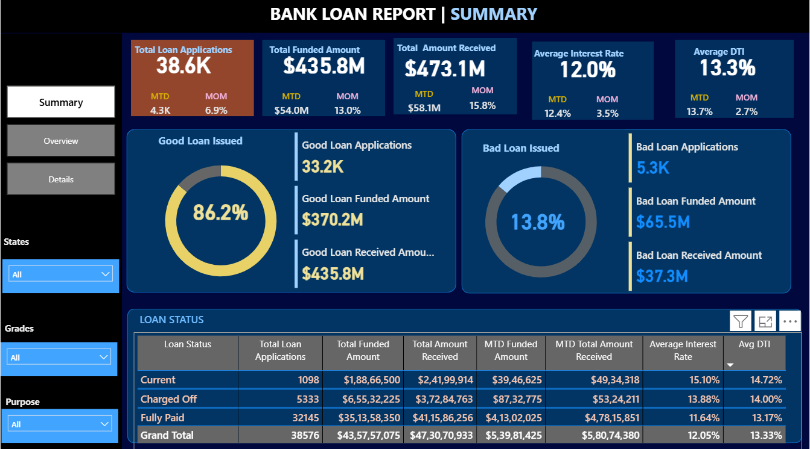
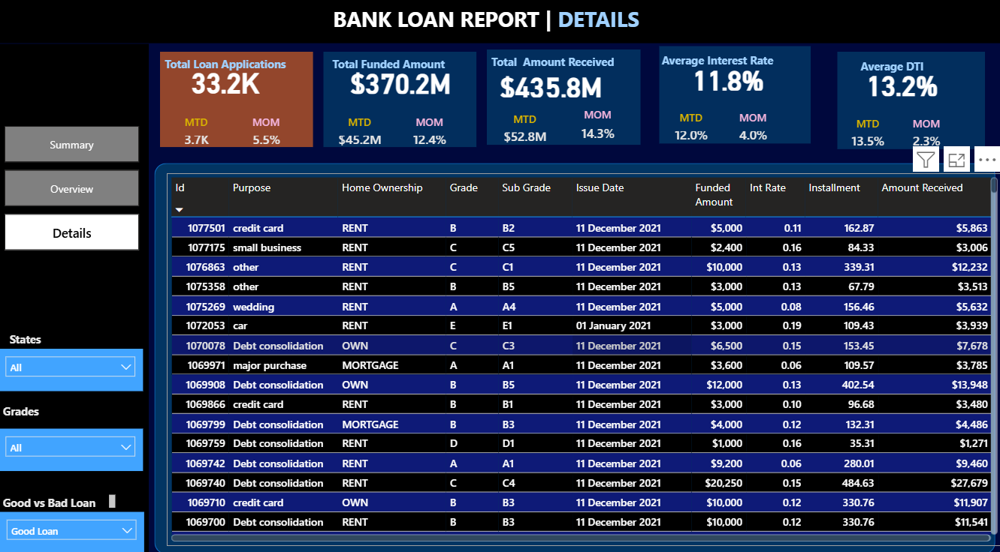
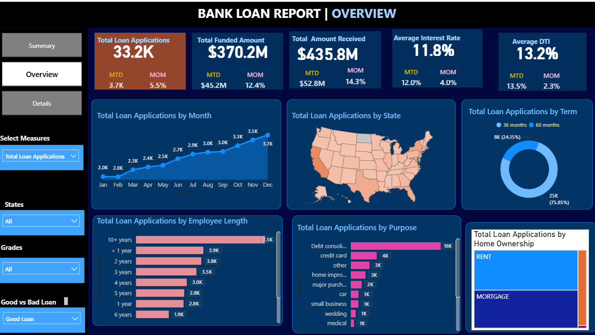

 # 📊 Bank Loan Analytics Project

## 🚀 Project Overview
This project focuses on analyzing bank loan data using **Python** and **Power BI** to uncover business insights, customer trends, loan performance, and risk analysis.

The dashboard provides interactive visualizations and KPI tracking for better decision-making in the banking and financial sector.

---

# 🛠️ Tools & Technologies Used

- Python
- Pandas
- NumPy
- Matplotlib
- Seaborn
- Plotly
- Power BI
- Excel

---

# 📌 Key KPIs

- Total Loan Applications
- Total Funded Amount
- Total Amount Received
- Good Loan Percentage
- Bad Loan Percentage
- Average Interest Rate
- Average Debt-to-Income Ratio (DTI)

---

# 📈 Analysis Performed

## ✅ Monthly Loan Trends
- Loan applications by month
- Funded amount trends
- Amount received trends

## ✅ Regional Analysis
- State-wise funded amount
- State-wise amount received
- Regional loan applications

## ✅ Loan Purpose Analysis
- Purpose-wise funded amount
- Purpose-wise repayments
- Purpose-wise applications

## ✅ Employment Analysis
- Employment length vs loan performance
- Employment-based funded amount

## ✅ Home Ownership Analysis
- Loan distribution by home ownership
- Payment trends by ownership category

## ✅ Loan Term Analysis
- 36-month vs 60-month loan comparison
- Loan performance by term

---

# 📊 Dashboard Features

- Interactive Power BI Dashboard
- KPI Cards
- Trend Analysis
- Drill-down Visuals
- State-wise Insights
- Dynamic Filtering
- Business Intelligence Reporting

---

# 📂 Files Included

| File | Description |
|------|-------------|
| `BANK_LOAN_ANALYSIS.py` | Python analysis script |
| `Bank_Loan_Dashboard.pbix` | Power BI Dashboard |
| `financial_loan_data_excel.xlsx` | Dataset |
| `image/` | Dashboard screenshots |

---

# 🖼️ Dashboard Preview

## 🔹 Overview Dashboard

---

## 🔹 KPI Dashboard

---

## 🔹 Loan Trends Dashboard

---

# 💡 Business Insights Generated

- Identified high-performing loan categories
- Tracked loan repayment behavior
- Evaluated regional lending trends
- Analyzed borrower risk patterns
- Compared good vs bad loan performance

---

# 🎯 Project Outcome

This project demonstrates:
- Data Cleaning
- Exploratory Data Analysis (EDA)
- KPI Development
- Data Visualization
- Dashboard Design
- Business Intelligence Skills

---

# 👨‍💻 Author

### Sibojit Nayak

Aspiring Data Analyst | Power BI Developer | Python Enthusiast

---
